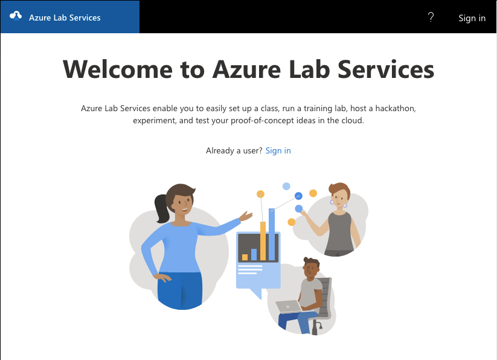
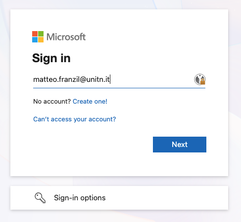
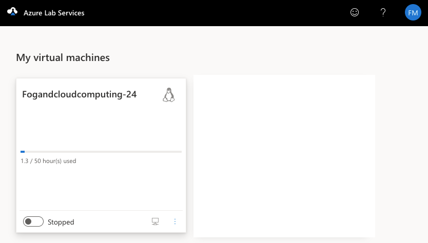

* Exercise 001 - Generate and upload your SSH key
  - Description :: If you do not have already one, generate an SSH key and save it on your laptop. Then move the key on the Lab VM in order to use public/private authentication. Check that you are able to login on the Lab VM without typing your password every time.

* Solutions and Instructions
Why can't I just type every time your password?
1) It is annoying and time consuming (given that password managers do not work well with terminals)
2) It is not secure: you may be tempted to use a weak password, and any individual that can contact the SSH server (your Lab VM) can try to brute-force your password
3) It is not robust, if you want to automate some tasks, you need to be able to login without typing a password every time

So, we will now generate a /keypair/, which is a pair of two plaintext files:
- A *private key* that you will keep on your laptop and that you must protect, encrypting with a passphrase and never sharing it with anyone
- A *public key* that you will upload on the Lab VM and that will be used by the SSH server to authenticate you when you will try to login using the corresponding private key

You can find [[https://www.ssh.com/academy/ssh/public-key-authentication][here]] more information which I suggest everyone to read carefully.

** Generate an SSH key
In *your laptop*, spin up a terminal.

First, check if you already have an ssh key, by listing the content of the =${HOME}/.ssh/= directory. If you have a file named =id_rsa= or =id_ed25519= (or similar, depending on the type of key) you already have one and can skip these steps.

If not, run:
#+begin_src sh
cd ~/.ssh
ssh-keygen -f fcc-lab.key
#+end_src

*Notice*: RSA keys are widely supported but considered less secure than newer algorithms like Ed25519. New OpenSSH versions default to Ed25519, which is recommended for most users. Do not worry if the SSH key seems "short".

The command will prompt you to enter a passphrase to protect your private key. This is optional, but it adds an extra layer of security. If you choose to set a passphrase, you will need to enter it every time you use the private key. If you do not want to set a passphrase, simply press Enter without typing anything. 

Our suggestion is to set up and use an SSH agent, which allows you to enter the passphrase once per session and then use the key without typing the passphrase every time. However, this is up to you and not mandatory for this lab.

After the interactive process, you should have generated a keypair:
#+BEGIN_SRC sh
ls ~/.ssh/fcc-lab.key*
#+END_SRC

You will find =fcc-lab.key= (the private key) and =fcc-lab.key.pub= (the public key).
Make sure to backup your private key in a safe and possibly offline place.

** Move the SSH key to the default location (optional)
In Linux and macOS, SSH keys are usually stored in the =${HOME}/.ssh/= directory, but you can choose to store them in a different location if you prefer. Just remember where you put them, as you will need to specify the path when using the SSH client.

In other systems (eg: Windows) the default path may be different, try with [[https://www.scammell.co.uk/2017/09/18/ssh-keygen-best-practice-for-cmder/][this]]; if you are using WSL, the default path is the same as Linux and macOS.

** Study the SSH client configuration
The SSH client looks for keys in the default location, but if you have stored your key in a different location, you need to inform the SSH client about it. You can do this by using the =-i= flag when running the =ssh= command, or by adding an entry in the SSH client configuration file (usually located at =${HOME}/.ssh/config=).

The former (in general) looks like this:
#+begin_src sh
  ssh -i $PATH_TO_YOUR_KEYS/fcc-lab.key $USER@$SERVER
#+end_src

The latter involves editing the SSH client configuration file and adding an entry like this:
#+begin_src sh
Host labvm
  HostName LAB_VM_URL
  Port LAB_VM_PORT
  User disi
  IdentityFile $PATH_TO_YOUR_KEYS/fcc-lab.key
#+end_src

** Generate the default password for the Azure Lab VM
If you still haven't, open the email you received with the invitation to Azure Labs.

Azure Labs requires UniTN authentication via Microsoft (even if it seems weird). Once you click on the link in the email, log in with your UniTN credentials and you will be sent to a page with a single VM.

Now, turn on the "Stopped" VM and once it is running, click on the very small "Connect" button (on the very right of the button you clicked). It will first prompt you to add a password for your VM, which you can choose as you like (but remember it, you will need it later if you want to reset the SSH key or if you want to use password authentication instead of key-based authentication). After that, it will show you the connection details for your Lab VM, which you will need to connect to it using SSH. It will look something like this:

#+begin_src sh
ssh -p 5000 disi@lab-49f7dc94-588a-4ec1-a6bf-418b9389c4a0.westeurope.cloudapp.azure.com
#+end_src

=LAB_VM_URL= is the URL of your Lab VM, and =LAB_VM_PORT= is the port you need to use to connect to it. You will need these details later to upload your SSH key and to connect to the Lab VM.

** Upload the key on the Lab VM
Now, you need to upload the public key on the Lab VM.

*** Using a proper SSH tool
Use the =ssh-copy-id= tool, which is smarter and does a check before adding the key:
#+begin_src sh
ssh-copy-id -p LAB_VM_PORT -i $PATH_TO_YOUR_KEYS/fcc-lab.key disi@LAB_VM_URL
#+end_src

*** Manually
Print the public part of the key and copy it to the clipboard (e.g., CTRL/CMD + C)
#+begin_src sh
cat fcc-lab.key.pub
#+end_src

SSH into the Lab VM using the command you got from Azure Labs.
#+begin_src sh
ssh -p LAB_VM_PORT disi@LAB_VM_URL
#+end_src

It will ask for the password you set in the previous step, so enter it and you will be logged in.

Using the editor of your choice, append it on a new line in the =~/.ssh/authorized_keys= file, then save and exit (Read [[https://www.cyberciti.biz/faq/linux-unix-vim-save-and-quit-command/][this]] if you never used Vim, for example)

#+begin_src sh
vim ~/.ssh/authorized_keys
#+end_src

*** Using an home-made trick
Use a combination of pipes, =cat= and =ssh=, we can directly append the content of the public key file on the =authorized_keys= file on the Lab VM without having to log in and edit it manually. This is a quick and dirty solution, but it works.

#+begin_src sh
cat fcc-lab.key.pub | ssh -p LAB_VM_PORT disi@LAB_VM_URL 'cat >> ~/.ssh/authorized_keys'
#+end_src

** Check if you are able to login wihtout password
First, log out from the Lab VM if you are still logged in, then try to login again using the =ssh= command. If everything is set up correctly, you should be able to login without typing your password every time.

#+begin_src sh
ssh -p LAB_VM_PORT disi@LAB_VM_URL
#+end_src

or with a more sophisticated way:

#+begin_src sh
ssh -p LAB_VM_PORT disi@LAB_VM_URL -n && echo OK || echo KO
#+end_src

*Remember:* If you set a passphrase for your private key, you will need to enter it every time you use the key, unless you are using an SSH agent.
*Remember:* If you are using a non-default path for your SSH keys, you will need to specify the path when using the SSH client, either with the =-i= flag or by configuring the SSH client.
#+begin_src sh
ssh -i fcc-lab.key -p LAB_VM_PORT disi@LAB_VM_URL
#+end_src
