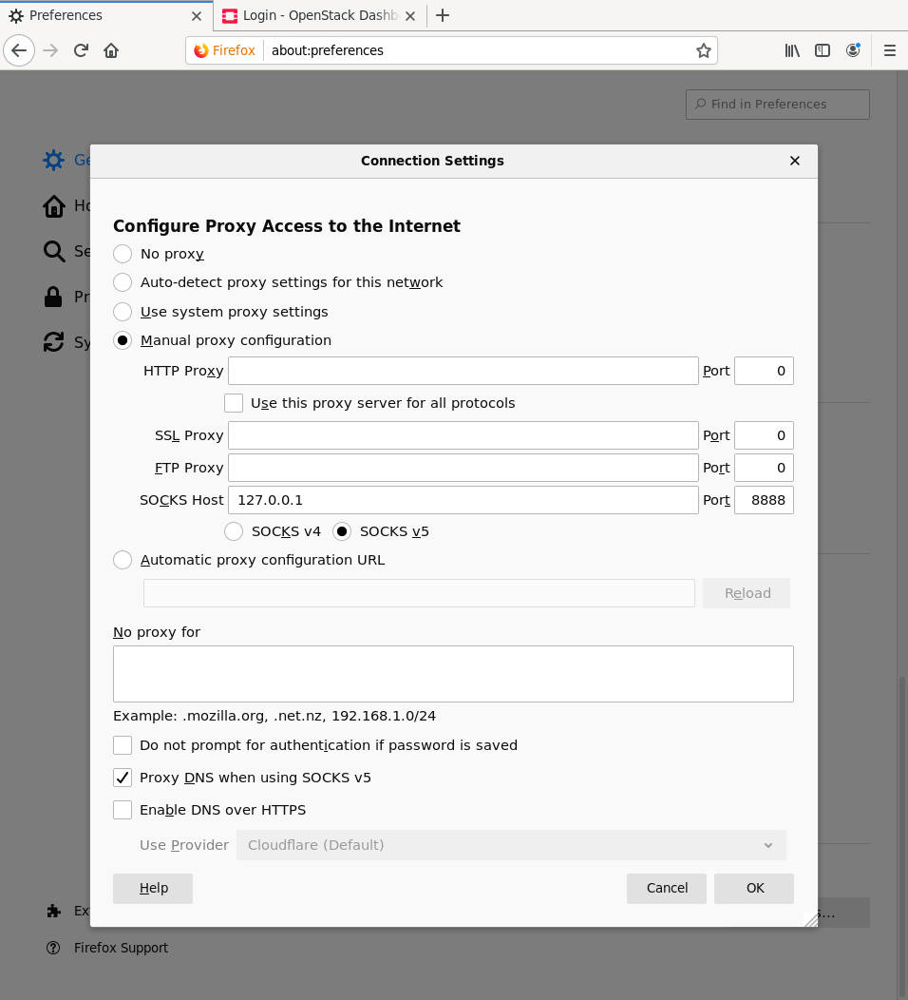
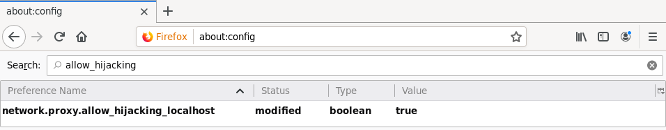

* Exercise 002 - Setup an SSH tunnel and use it as a SOCKS proxy in a web Browser
  - Description :: Learn how to use SSH tunnels to securely access services running on the Lab VM from your local machine. This exercise will guide you through setting up an SSH tunnel that forwards a local port to the Lab VM, allowing you to access services running on the Lab VM as if they were running on your local machine. You will also configure your web browser to use this tunnel as a SOCKS proxy, enabling you to browse the web through the Lab VM's network connection.

* Solutions and Instructions
** Learn which types of tunneling exist
SSH supports three types of tunneling: local, remote, and dynamic. Each type serves a different purpose and can be used in various scenarios to securely forward traffic between a local machine and a remote server.

For more information on SSH tunneling, you can refer to the official OpenSSH documentation: [[https://www.ssh.com/academy/ssh/tunneling]].

*** Local tunneling
Local tunneling allows you to forward a local port on your machine to a port on the remote server. This is useful when you want to access a service running on the remote server as if it were running on your local machine. For example, if you have a web server running on the remote server on port 80, you can forward it to your local machine's port 8080, allowing you to access it via http://localhost:8080.

To set up a local tunnel, you can use the following SSH command:
#+begin_src sh
ssh -L local_port:remote_host:remote_port user@server
#+end_src

*** Remote tunneling
With remote tunneling, the forwarding is done in the opposite direction. It allows you to forward a port on the remote server to a port on your local machine. Imagine you are developing a web application on your local machine and want to share it on a remote servers where other developers can access and tinker with it. Thus, you can do:

#+begin_src sh
ssh -R remote_port:localhost:local_port user@server
#+end_src

and then the other developers can access the application via http://server:remote_port, which will forward the traffic to your local machine's port.

*** Dynamic tunneling

Dynamic tunneling is a more flexible form of tunneling that allows you to create a SOCKS (Socket Secure) proxy server on your local machine. First, you choose a local port to listen on, and then *any* traffic sent to that port will be forwarded through the SSH connection to the remote server.

Imagine your remote server has a development environment where several containers are running, each exposing different services on different ports, e.g., =123.45.67.89:12451=. Instead of setting up multiple local tunnels for each service, you can create a single dynamic tunnel that acts as a SOCKS proxy. Thus, when you configure your web browser (or any HTTP client) to use this SOCKS proxy, any request made through the browser will be forwarded to the remote server, and the remote server will handle the request as if it originated from there. 

As a result, if you access http://123.45.67.89:12451 through the SOCKS proxy, the request will be forwarded to the remote server and you will visit the service running on that port, even though it is not directly accessible from your local machine.

To set up a dynamic tunnel, you can use the following SSH command:

#+begin_src sh
  ssh -D ${SOCKS_ADDR}:${SOCKS_PORT} -p LAB_VM_PORT disi@LAB_VM_URL
#+end_src

This command will create a SOCKS proxy on your local machine at the specified address and port, forwarding all traffic through the SSH connection to the Lab VM. Read the next section to learn how to configure your browser to use this SOCKS proxy.

** Configure a browser to use a SOCKS proxy
This section heavily depends on your browser and even on its version, so the instructions are quite generic. If you have trouble configuring your browser, please ask for help on the Moodle forum.

First, we need to identify the address and port where the SOCKS proxy will listen for connections. Since the tunnel is set up on your laptop, you can make it listen on the loopback interface (=localhost=, also known as =127.0.0.1=) and on a port of your choice from the high unprivileged port range (e.g., =4444= or =8888=). For this exercise, let's use:

#+begin_src sh
SOCKS_ADDR=127.0.0.1
SOCKS_PORT=8888
#+end_src

*** Using a browser extension
Modern versions of Firefox have support for [[https://addons.mozilla.org/en-US/firefox/addon/multi-account-containers/][Multi-Account Containers]] which allows you to separate your browsing contexts. Usually, the use case is to keep different types of browsing activities separate, enhancing privacy and organization. However, it can also be used to separate the browsing context of the SOCKS proxy.

To use the Multi-Account Containers extension to separate the browsing context of the SOCKS proxy, follow these steps:

1. Install the Multi-Account Containers extension from the provided link.
2. Create a new container for your SOCKS proxy usage.
3. Configure the container's settings to use the SOCKS proxy address and port you set up earlier.

*** Configuring your browser
The examples are for a modern version of Firefox.

Optionally, you can create a profile in your preferred browser, for Firefox starts with:
#+begin_src sh
firefox --no-remote --ProfileManager
#+end_src

In Firefox under the network setting, add a SOCKS proxy with the address of the =$SOCKS_ADDR= and the port of the =$SOCKS_PORT= identified above.

In very recent versions of Firefox, you will also need to set =network.proxy.allow_hijacking_localhost= to =true= in =about:config=, see [[https://bugzilla.mozilla.org/show_bug.cgi?id=1535581][https://bugzilla.mozilla.org/show_bug.cgi?id=1535581]]

*** Using curl

You can also use curl to test the connection. The following command will use the SOCKS proxy to connect to the Lab VM. The =-x= flag is used to specify the proxy address and port.

#+begin_src sh
curl -x socks5h://$SOCKS_ADDR:$SOCKS_PORT http://localhost
#+end_src

** Create a dummy service on the Lab VM
The below simple snippet will expose a web server that shows the content of the file =index.html=.
#+begin_src sh
  mkdir ws
  cd ws
  echo "Hello from FCC Lab Web Server" > index.html
  python3 -m http.server
#+end_src

Identify the exposed port (it should be the port =8000=) and open on your modified browser the following URL: http://localhost:8000.

What do you see in the browser? What do you see in the terminal? Where are the connections coming from?
