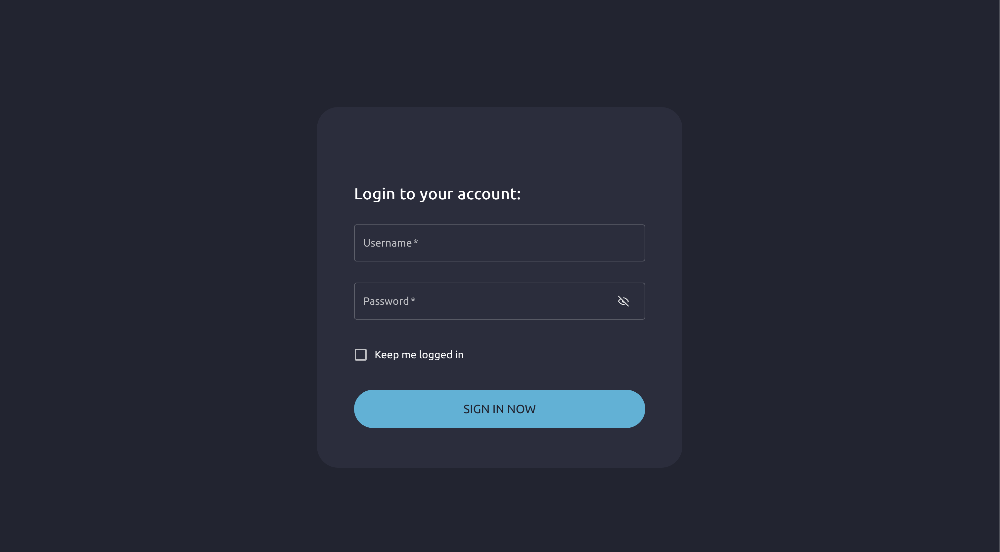
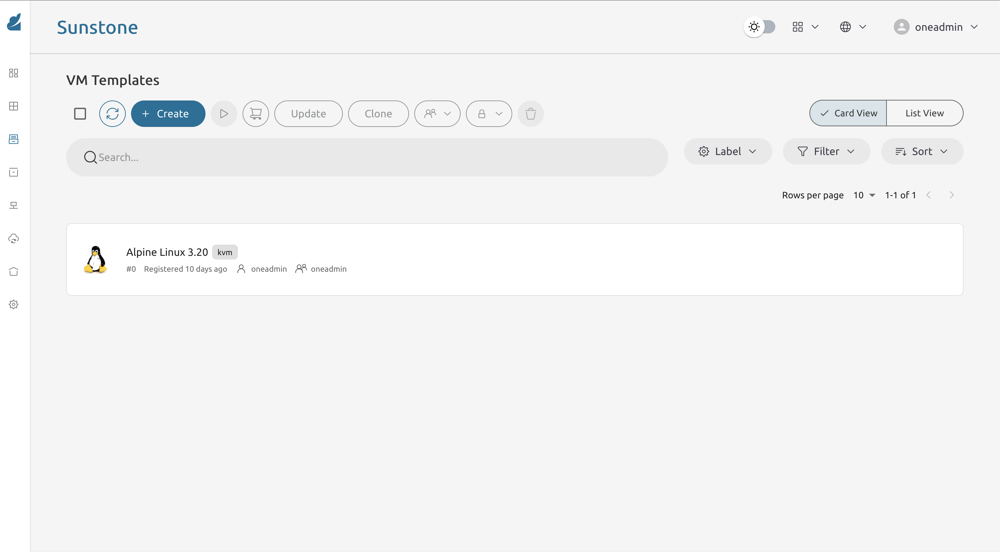
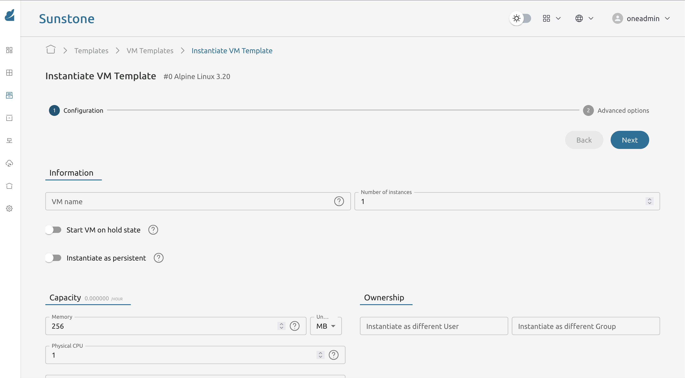
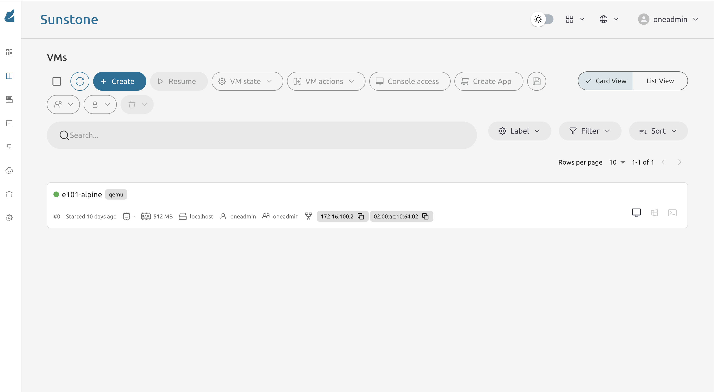
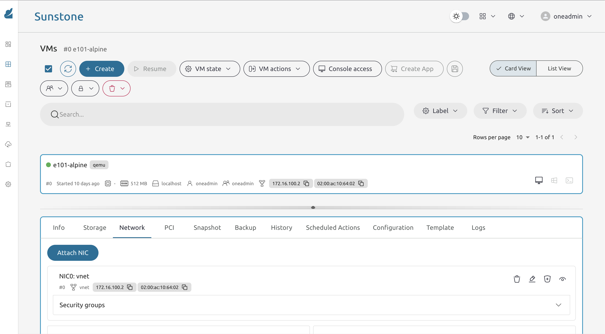

* Exercise 101 - Create your first virtual machine on OpenNebula
  - Description :: Access the FireEdge/Sunstone web interface provided by MiniOne, instantiate an Alpine Linux virtual machine from an existing template, and monitor its lifecycle until it is running. By the end of the exercise you will have a live VM and its private IP address, which you will need in the following exercises.

* Solutions and Instructions

** Access the OpenNebula dashboard
MiniOne exposes the FireEdge UI through its own web server on the standard HTTP port. Open the following URL in your browser, replacing the placeholder with the internal IP of your Azure Lab VM:

#+begin_src sh
http://[YOUR_ETH0_IP]
#+end_src

Since the Azure Lab VM does not expose this port to the public internet, you need the SOCKS proxy tunnel set up in Exercise 002 to be active, with your browser configured to use it.

Log in with the credentials that can be found at $HOME/setup/minione.log. The default username set by MiniOne is =oneadmin=.

** Navigate to VM Templates
After login you will land on the FireEdge dashboard. From the left sidebar, navigate to:

*Templates -> VM Templates*

Look for a template named =Alpine Linux= or similar. This is the lightweight image used throughout the first exercises.

** Instantiate the VM
Click on the Alpine template row and select *Instantiate*. In the instantiation form:

- Set the *VM Name* to something unique and recognizable, for example:

#+begin_src sh
e101-alpine
#+end_src

- Leave CPU, memory, storage and network as their default values.

Confirm by clicking *Instantiate*.

** Monitor the lifecycle
Navigate to *Instances -> VMs* and open the detail page of your new VM. Watch the state field update through the following progression:

#+begin_example
PENDING -> PROLOG -> BOOT -> RUNNING
#+end_example

The whole process usually takes under a minute. 

** Record the VM information
Once the VM is in =RUNNING= state, open its *Network* tab and note down the private IP address. Also note the numeric VM ID visible in the VM list.

#+begin_example
VM_ID = (shown in the VM list)
VM_IP = (shown in the Network tab, e.g. 172.16.100.x)
#+end_example

