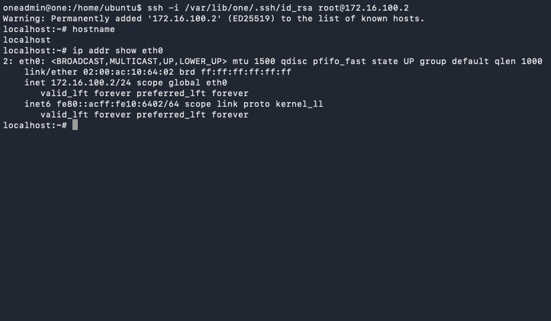

* Exercise 103 - Access your VM via SSH
  - Description :: MiniOne generates an SSH keypair for the =oneadmin= user during installation. That key is automatically injected into every VM created from a contextualized template, so you can use it to log in without setting a password. In this exercise you will use that key to open a shell inside the Alpine VM you created in Exercise 101.

* Solutions and Instructions

** Locate the MiniOne SSH key
The key is stored on the Azure Lab VM (the machine running MiniOne). Connect to it and confirm the key is present:

#+begin_src sh
sudo -iu oneadmin
ls -l /var/lib/one/.ssh/id_rsa
#+end_src

You should see a file owned by =oneadmin=. You do not need to copy or export it — you will run the SSH command from the Azure Lab VM itself.

** SSH into the Alpine VM
Use the private IP you recorded at the end of Exercise 101:

#+begin_src sh
VM_IP=REPLACE_WITH_VM_IP
ssh -i /var/lib/one/.ssh/id_rsa root@$VM_IP
#+end_src

The first time you connect, SSH will ask you to confirm the host fingerprint. Type =yes= and press Enter.

#+begin_example
The authenticity of host '172.16.100.x' can't be established.
ED25519 key fingerprint is SHA256:...
Are you sure you want to continue connecting (yes/no/[fingerprint])? yes
Warning: Permanently added '172.16.100.x' (ED25519) to the list of known hosts.
#+end_example

If the connection is refused, the VM may still be booting its contextualization scripts. Wait a few seconds and retry.

** Verify you are inside the VM
Once logged in, run a couple of commands to confirm you are on the right machine:

#+begin_src sh
hostname
ip addr show eth0
#+end_src

You should see the hostname as localhost and the private IP matching what the dashboard.

** Keep the session open
Leave this SSH session running. You will need it in the next exercise to install software on the VM.

*IMPORTANT:*

*The =oneadmin= key gives root access to every VM in the cluster. Never share it or copy it to untrusted machines.*