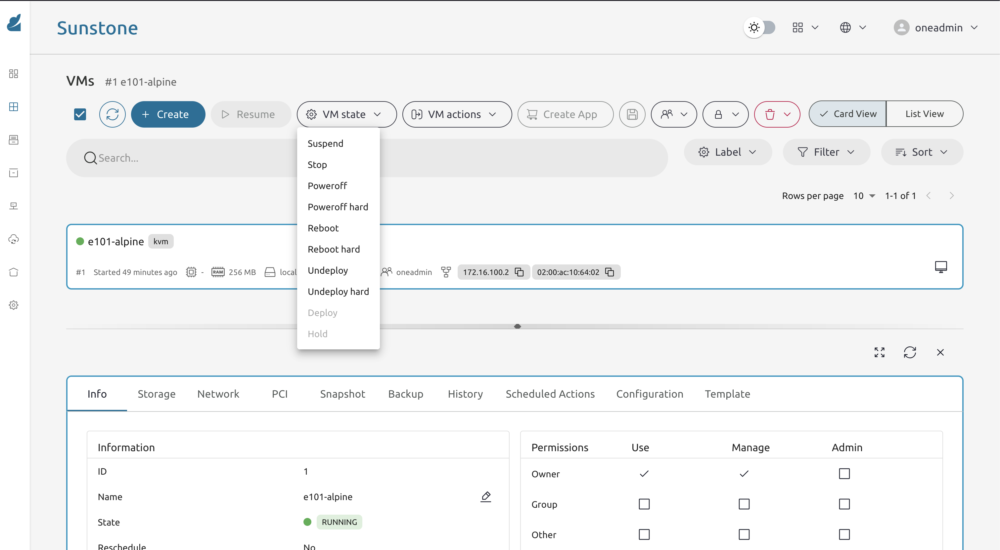
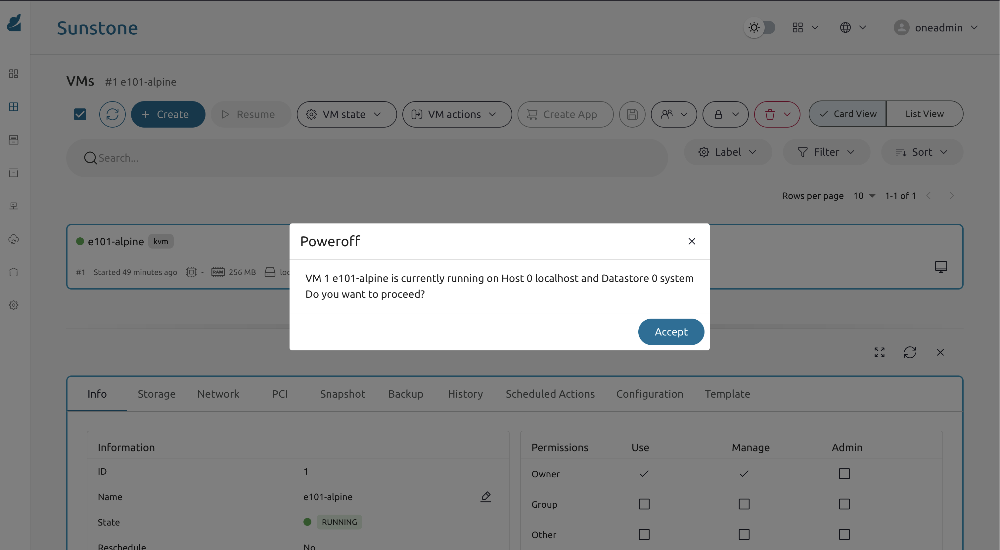
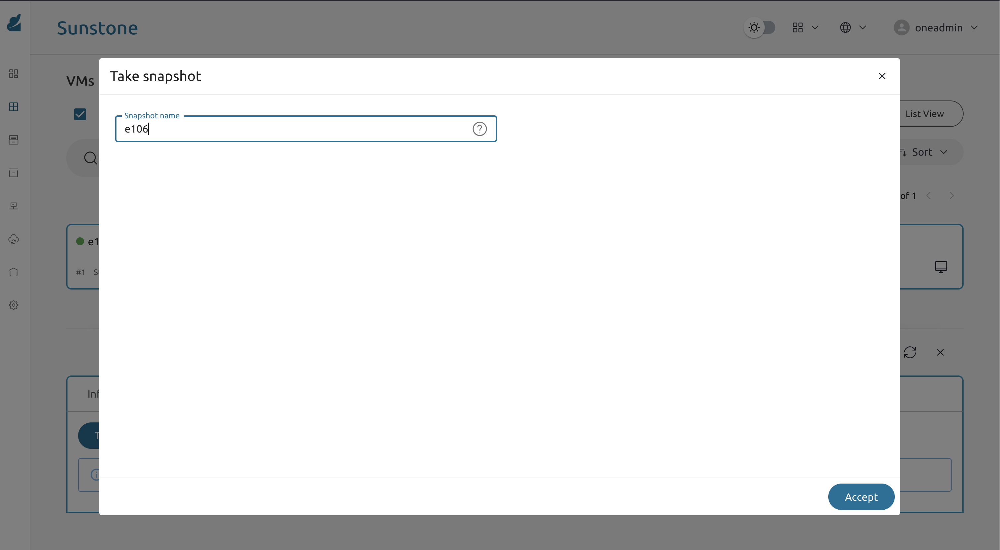

* Exercise 106 - Manage the VM lifecycle
  - Description :: OpenNebula manages every VM through a well-defined lifecycle: from the moment it is created to the moment it is deleted. Knowing how to move a VM between states — pause it, snapshot its disk, restore from a snapshot, and terminate it cleanly — is a daily skill in cloud operations. In this exercise you will practice these actions on the Alpine Nginx VM from Exercise 105.

* Solutions and Instructions

** The OpenNebula VM lifecycle at a glance
The states you will interact with most often are:

#+begin_example
PENDING → PROLOG → BOOT → RUNNING
                              │
                    ┌─────────┼──────────┐
                 SUSPEND   POWEROFF   SNAPSHOT
                    │         │
                 SUSPENDED  POWEROFF
                    │         │
                 RESUME    POWERON
                    │         │
                    └────► RUNNING
#+end_example

- *SUSPEND*: the VM is frozen in memory (like laptop sleep). Fast to resume, but still consumes host memory.
- *POWEROFF*: the guest OS is shut down cleanly. No memory used, but slower to resume since it must boot again.
- *SNAPSHOT*: a point-in-time copy of the VM's disk saved as a new image. The VM keeps running.

** Suspend and resume the VM
In FireEdge, open *Instances → VMs*, click on the Alpine Nginx VM and find the action buttons.

Click *Suspend*. The VM state should move to =SUSPENDED= within a few seconds.

Try to reach the Nginx page in your browser — it should time out. Then click *Resume* and wait for =RUNNING= to come back. Refresh the browser; the page should reappear without any changes.

** Poweroff and power on the VM
Click *Poweroff*. This sends an ACPI shutdown signal to the guest OS, which shuts down cleanly. The state becomes =POWEROFF=.

Notice the difference in the resource panel: memory usage drops to zero, unlike Suspend where it remained allocated.

Click *Power On* and wait for =RUNNING=.

** Take a disk snapshot
With the VM running, open its *Snapshot* tab, and click *Take snapshot*.

Name the snapshot =before-changes= and confirm. OpenNebula will create a frozen copy of the disk image. The VM keeps running while the snapshot is taken.

Verify the snapshot appears in the list with a =READY= state.

** Make a change and restore the snapshot
Make a visible change inside the VM to verify the restore:

#+begin_src sh
ssh -i /var/lib/one/.ssh/id_rsa root@VM_IP
echo "<h1>BROKEN - this should disappear after restore</h1>" > /var/www/localhost/htdocs/index.html
#+end_src

Reload the Nginx page in your browser — you should see the broken message.

Now, try to restore the snapshot by clicking *Restore* on the =before-changes= snapshot in the *Snapshot* tab.

The VM will briefly go into =POWEROFF= while the disk is replaced by the snapshot image, then return to =RUNNING=. Refresh the browser — the original page should be back.

** Terminate the VM (when you no longer need it)
When you are done with a VM for good, use *Terminate* (not Poweroff or Suspend). This deletes the VM record and releases its disk back to the datastore.

*Do not terminate the Alpine Nginx VM yet*

*IMPORTANT:*

*Snapshots consume datastore space. Delete snapshots you no longer need using the trash icon in the Snapshot tab. As a rule: keep at most one snapshot per VM while working through the lab.*
