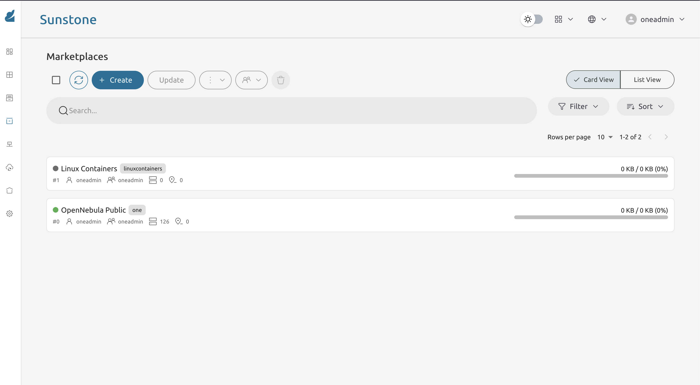
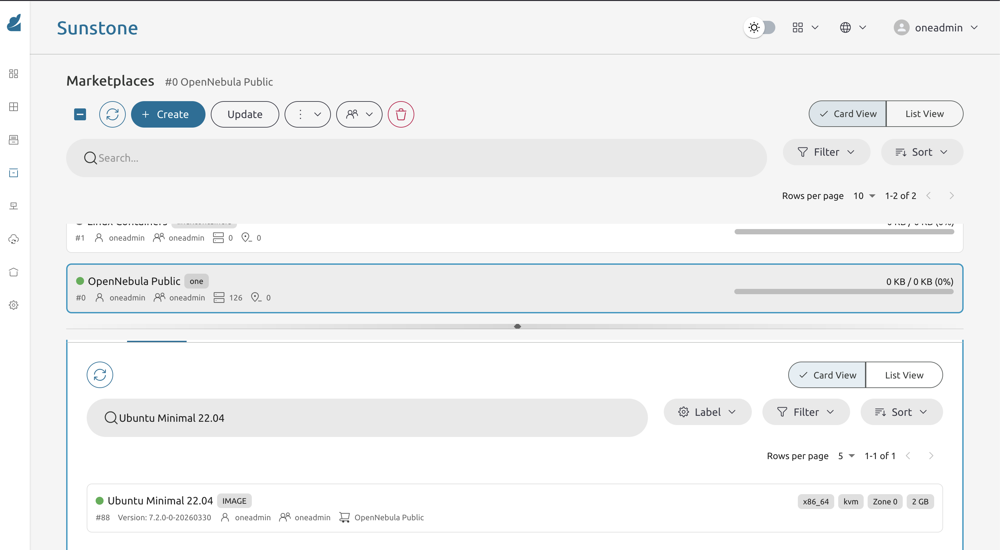
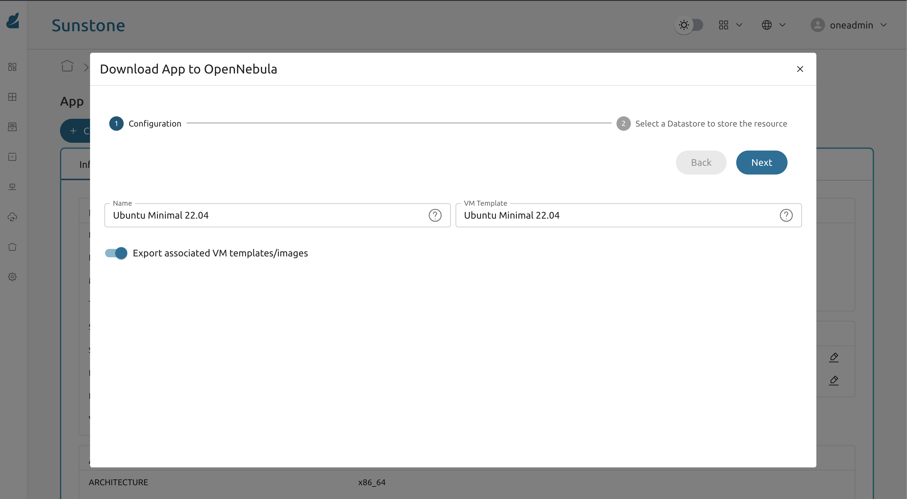

* Exercise 107 - Import an image from the OpenNebula Marketplace
  - Description :: The OpenNebula Public Marketplace is a catalogue of ready-to-use virtual machine images maintained by the OpenNebula project. Instead of building images from scratch, you can download a pre-built one and immediately create VMs from it. In this exercise you will import an Ubuntu 22.04 image and verify it is available in your local datastore.

* Solutions and Instructions

** Open the Marketplace in FireEdge
In the FireEdge dashboard navigate to:

*Storage → Marketplaces*

You will see a list of configured marketplace sources. The *OpenNebula Public* marketplace should be present by default in a MiniOne installation.

** Browse and search for the image
Click on *OpenNebula Public* to open the catalogue. Use the search bar to find:

#+begin_example
Ubuntu 22.04
#+end_example

Several results may appear (minimal, KVM, LXC variants). Select the one labelled *Ubuntu 22.04 - KVM* or the plain =Ubuntu 22.04= image that targets the KVM hypervisor, which is what MiniOne uses.

** Import the image to your datastore
Click the download / import button. A dialog will ask you to choose a destination datastore.

Select the *default* image datastore (usually called =default= or =images=) and confirm.

OpenNebula will start downloading and converting the image in the background. The image state will progress:

#+begin_example
LOCKED → READY
#+end_example

This can take several minutes depending on the network. You can monitor progress under *Storage → Images*.

** Verify the image is ready
Once the state shows =READY=, confirm it is available via CLI as well:

#+begin_src sh
oneimage list
#+end_src

#+begin_example
  ID USER     GROUP    NAME                   DATASTORE     SIZE TYPE  PER STAT  RVMS
   0 oneadmin oneadmin Alpine Linux           default       256M OS    No ready     1
   1 oneadmin oneadmin Ubuntu Minimal 22.04   default       2.2G OS    No ready     0
#+end_example

Note the image ID -- it is available as a base for creating VM templates in subsequent exercises.

*IMPORTANT:*

*Marketplace images count against your datastore quota. Do not import multiple copies of the same image. If you made a mistake, delete the duplicate from Storage → Images before proceeding.*