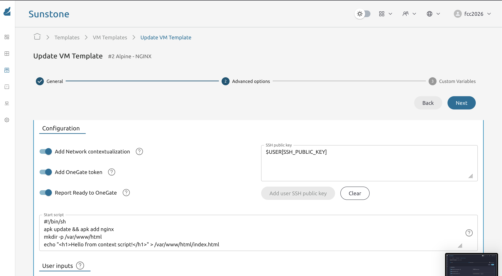

* Exercise 109 - Provision a VM with a context start script
  - Description :: OpenNebula's contextualization mechanism can run an arbitrary shell script at first boot via the =Start script= field in the template. This lets you provision software automatically without touching the VM manually - the VM configures itself. In this exercise you will use a start script to install Nginx and serve a custom page, then observe the tradeoff: every new VM must run the script from scratch, which motivates the golden image approach in Exercise 110.

* Solutions and Instructions

** Edit the template: add a start script
In FireEdge navigate to *Templates -> VM Templates*, find the Alpine template, clone it, and name the clone =Alpine - NGINX=. click *Update*. Go to the *Advanced options*, than *Context* tab.

Enable *Start script* and paste the following:

#+begin_src bash
#!/bin/sh
apk update && apk add nginx
mkdir -p /var/www/localhost/htdocs
echo "<h1>Hello from context script!</h1>" > /var/www/localhost/htdocs/index.html
cat > /etc/nginx/http.d/default.conf <<'EOF'
server {
    listen 80;
    root /var/www/localhost/htdocs;
    index index.html;
}
EOF
rc-service nginx start
rc-update add nginx default
#+end_src

Save the template.

** Instantiate a new VM
Navigate to *Templates -> VM Templates*, select the Alpine template, and click *Instantiate*. Name it =e109-alpine=.

Watch the state transitions in FireEdge: =PENDING -> PROLOG -> BOOT -> RUNNING=.

*Note*: the start script runs during the =RUNNING= phase, after the OS boots. Wait an extra 30-60 seconds after the VM reaches =RUNNING= before trying to connect.

** Verify Nginx is running without manual intervention
Open your browser through the SOCKS proxy and navigate to:

#+begin_example
http://VM_IP
#+end_example

You should see the custom page - without ever SSH-ing into the VM.

You can also verify via SSH if needed:

#+begin_src sh
ssh root@VM_IP
# Check nginx is running
rc-service nginx status
# Check the page is served locally
wget -qO- http://localhost
#+end_src