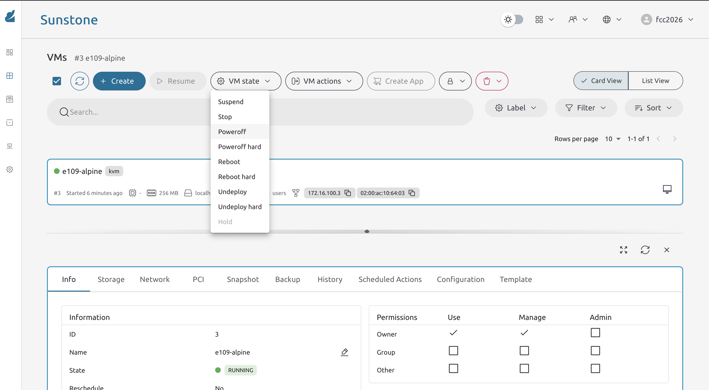
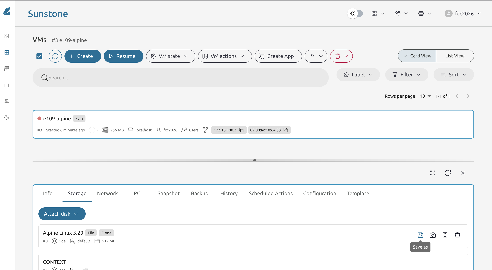
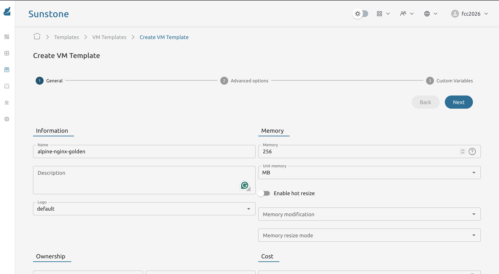

* Exercise 110 - Save a golden image and create a reusable template
  - Description :: Manually configuring every new VM is tedious and error-prone. A better workflow is to configure one VM perfectly, save its disk as a "golden image", and then create a template that points to it. Any subsequent VM instantiated from that template starts already configured - no scripts, no SSH, no manual steps. In this exercise you will capture the =e109-alpine= VM (provisioned by context script in Exercise 109) as a golden image and build a template from it that you will reuse in Exercise 112.

* Solutions and Instructions

** Poweroff the Alpine Nginx VM cleanly
A consistent image requires the VM to be powered off so that the filesystem is in a clean state.

In FireEdge navigate to *Instances -> VMs*, find =e109-alpine= and click *Poweroff*. Wait until the state shows =POWEROFF=.

** Save the disk as a new image
With the VM powered off, open its detail page and go to the *Storage* tab. Next to the disk entry you will find a *Save As* button (the icon may look like a floppy disk or a camera).

Click it and fill in the dialog:
- *Image name*: =alpine-nginx-golden=
- *Image type*: OS

Confirm. OpenNebula will clone the VM's current disk into a new image in the datastore. You can monitor progress under *Storage -> Images* - wait for the state to become =READY=.

** Verify the image via CLI
#+begin_src sh
oneimage list
#+end_src

#+begin_example
  ID USER     GROUP    NAME                   DATASTORE     SIZE TYPE  STAT
   2 fcc2026  users    alpine-nginx-golden    default       512M OS    No rdy     0
   1 oneadmin oneadmin Ubuntu Minimal 22.04   default       2.2G OS    No rdy     0
   0 oneadmin oneadmin Alpine Linux 3.20      default       512M OS    No used    2
#+end_example

** Create a template from the golden image
In FireEdge navigate to *Templates -> VM Templates* and click *Create*.

Fill in the *General* tab:
- *Name*: =alpine-nginx-golden=
- *Memory*: 256 MB
- *vCPU*: 1

In the *Storage* tab, click *Add disk* and select the =alpine-nginx-golden= image.

In the *Network* tab, add the =vnet= virtual network.

Save the template.

** Verify the golden template works
Instantiate a new VM from the =alpine-nginx-golden= template. Name it =e110-alpine=.

Once it reaches =RUNNING=, open your browser through the SOCKS proxy and navigate to:

#+begin_example
http://NEW_VM_IP
#+end_example

You should see the Nginx page immediately, with no delay and no manual configuration. The VM is production-ready from the first boot.

Delete the test VM after verifying - you have the template now.

** What to keep for the next exercise
- The =alpine-nginx-golden= image in the datastore.
- The =alpine-nginx-golden= template in *Templates -> VM Templates*.

You will use this template in Exercise 112 to deploy both the proxy and backend VMs without any additional manual configuration.

*IMPORTANT:*

*The golden image is a snapshot of the disk at the moment you ran Save As. If you later change something on a running VM, those changes are not automatically reflected in the image - you would need to repeat the Save As process.*
