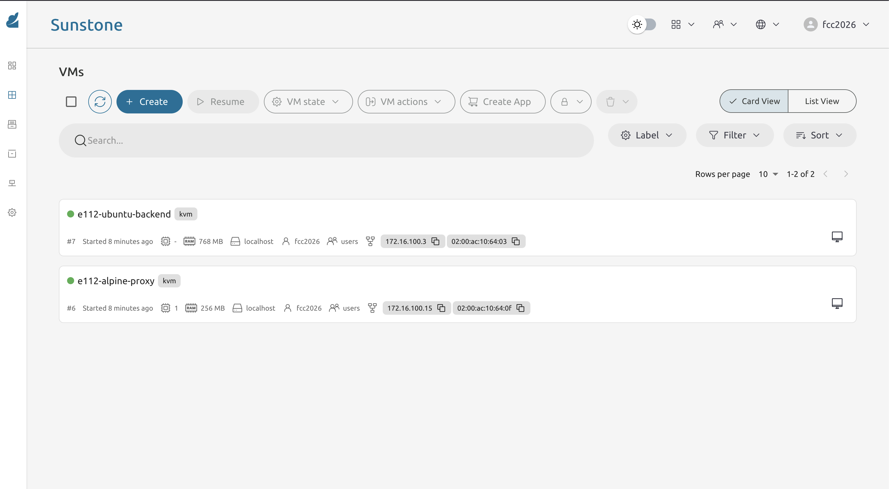
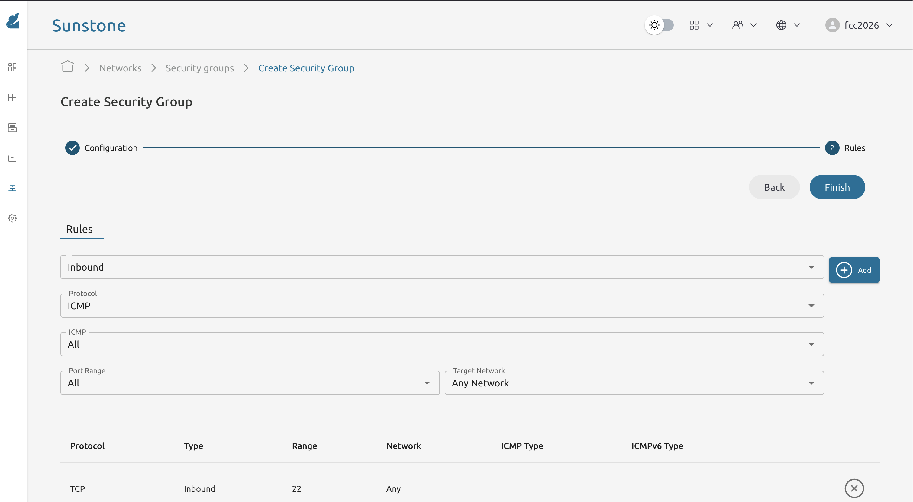
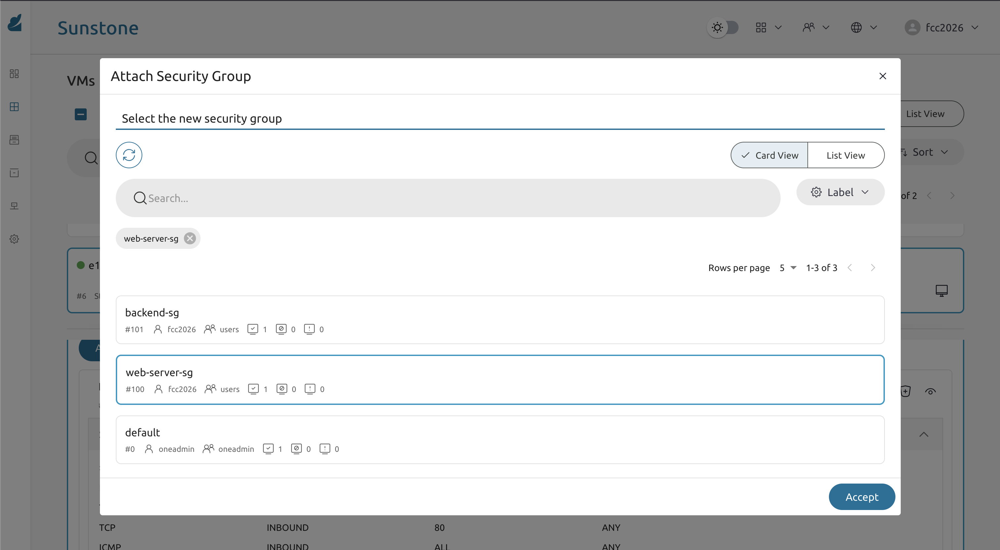

* Exercise 111 - Control traffic with Security Groups
  - Description :: By default every VM in OpenNebula can receive traffic on any port from any source. Security Groups let you define firewall rules at the virtual network level - OpenNebula programs them into the hypervisor's =ebtables=/=iptables= automatically. In this exercise you will spin up an Ubuntu VM running Nginx on port 80 and an Alpine VM as a client. You will create a security group that allows both SSH and HTTP, verify HTTP works, then remove the HTTP rule and observe that traffic is blocked at the hypervisor level.

* Solutions and Instructions

** Instantiate the two VMs

*Server VM (Ubuntu)*: find the Ubuntu 22.04 image imported in Exercise 107 and instantiate it as =e111-ubuntu-server=, adding a context start script:

#+begin_src bash
#!/bin/bash
apt-get update -y
apt-get install -y nginx
cat > /var/www/html/index.html <<EOF
<!DOCTYPE html>
<html><head><title>FCC e111</title></head>
<body><h1>e111 Ubuntu server</h1></body>
</html>
EOF
systemctl enable --now nginx
#+end_src

Wait ~60 s for the script to complete, then record the IP:

#+begin_example
SERVER_IP = (Network tab of e111-ubuntu-server)
#+end_example

*Client VM (Alpine)*: instantiate the =alpine-nginx-golden= image from Exercise 110 as =e111-alpine-client=. No extra configuration is needed - Alpine already has =curl= available.

#+begin_example
CLIENT_IP = (Network tab of e111-alpine-client)
#+end_example

** Verify connectivity before applying any security group

SSH into the Alpine client and confirm it can reach the Ubuntu server on port 80:

#+begin_src sh
ssh root@CLIENT_IP
curl http://SERVER_IP
#+end_src

You should see the HTML page returned. This is the baseline - no security group is active yet.

** Create the security group

Navigate to *Network -> Security Groups* and click *Create*.

Name the group =web-server-sg= and add the following inbound rules:

| Direction | Protocol | Port | Network |
|-----------|----------|------|---------|
| Inbound   | TCP      | 22   | ANY     |
| Inbound   | TCP      | 80   | ANY     |
| Inbound   | ICMP     | -    | ANY     |

Leave all other traffic as *DROP* (the implicit default when no rule matches).

Save the security group.

** Attach the security group to the Ubuntu server VM

Go to *Instances -> VMs*, select =e111-ubuntu-server=, open the *Network* tab, detach the =default= security group, and attach =web-server-sg=.

** Verify that port 80 is still reachable

From the Alpine client, confirm HTTP still works with the security group active:

#+begin_src sh
curl --max-time 5 http://SERVER_IP
# expected: HTML page returned
#+end_src

** Remove port 80 from the security group and verify it is blocked

Edit =web-server-sg= and remove the TCP port 80 rule, leaving only SSH and ICMP:

| Direction | Protocol | Port | Network |
|-----------|----------|------|---------|
| Inbound   | TCP      | 22   | ANY     |
| Inbound   | ICMP     | -    | ANY     |

Save the updated security group. From the Alpine client, try again:

#+begin_src sh
curl --max-time 5 http://SERVER_IP
# expected: curl: (28) Connection timed out after 5000 milliseconds
#+end_src

A *timeout* - not "connection refused" - confirms the hypervisor is silently dropping the packet before it reaches the VM. =Connection refused= would mean the packet arrived but nothing was listening; =timed out= means it was dropped at the network level.

** Re-add port 80 and confirm traffic is restored

Edit =web-server-sg= again and add the TCP port 80 rule back. From the Alpine client:

#+begin_src sh
curl --max-time 5 http://SERVER_IP
# expected: HTML page returned
#+end_src

This confirms security group changes take effect immediately without restarting the VM.

** Inspect the rules from the CLI

#+begin_src sh
onesecgroup list
onesecgroup show SECGROUP_ID
#+end_src

*IMPORTANT:*

*Security groups are enforced by the hypervisor, not by the guest OS. Even if you disable =iptables= inside the Ubuntu VM, the rules remain active. This is a key difference from a traditional firewall configured inside the OS.*